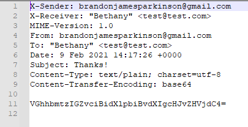
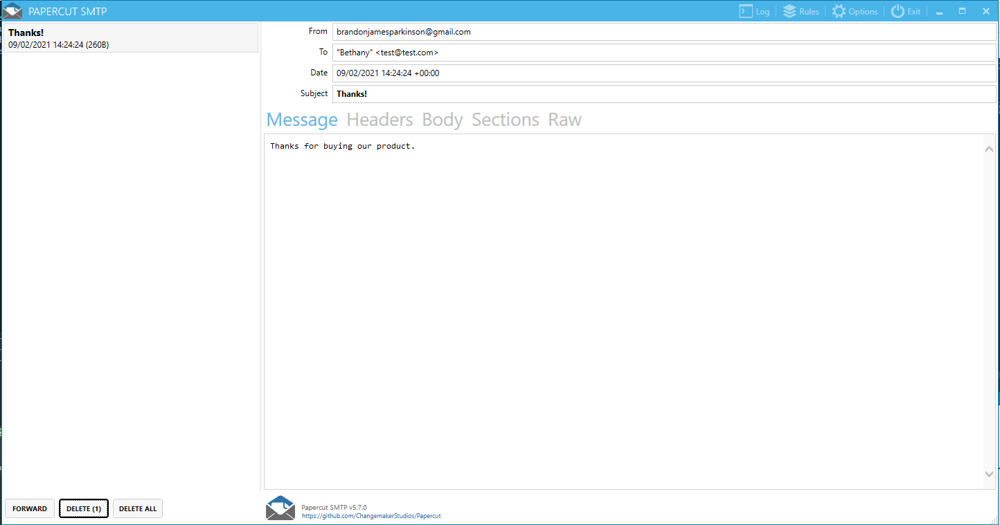
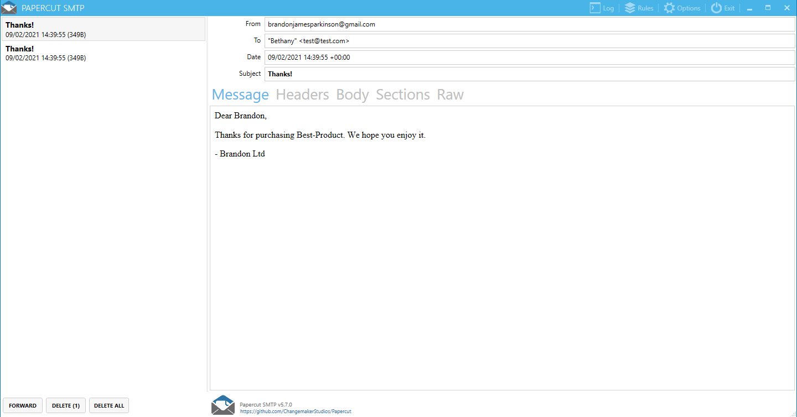

## Sending E-Mail in C# with FluentEmail 
### [I used Papercut as the SMTP Server](https://github.com/ChangemakerStudios/Papercut-SMTP/releases)

#### Writing to an EML File 

#### Sending Via Network Server 

#### Sending Via Network Server W/ Razor File 

